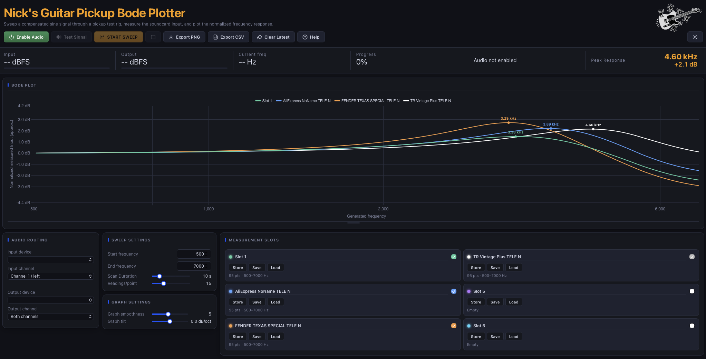
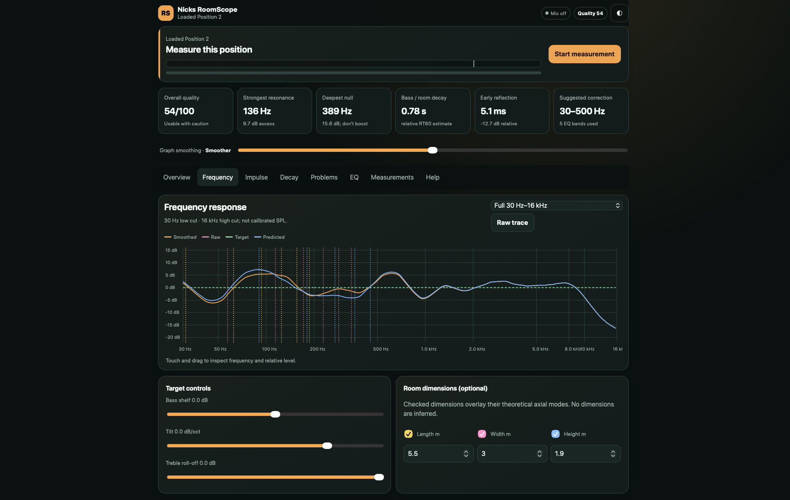
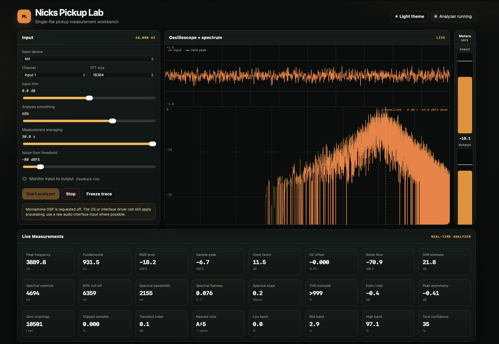
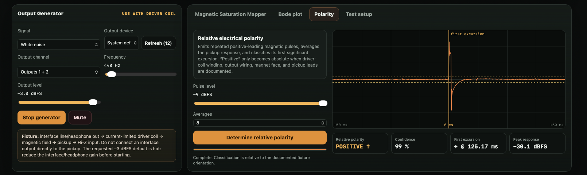
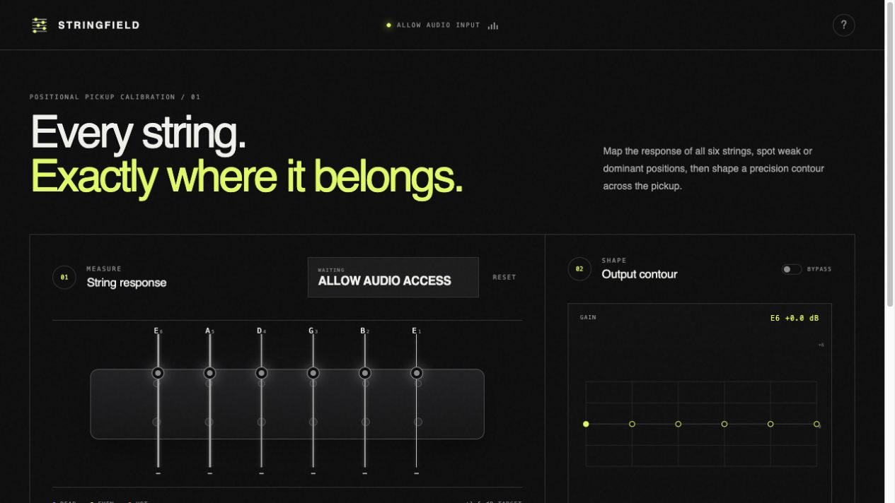
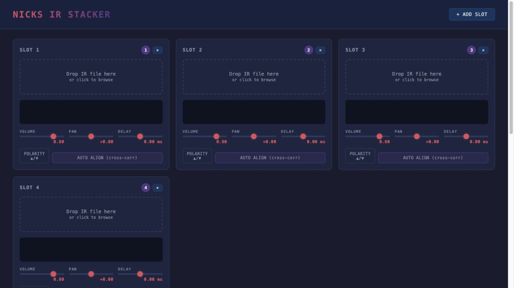

# Nick's Audio Tools

A collection of focused, browser-based tools for guitar pickup measurement, room acoustics, and impulse-response work. Each tool runs directly in the browser with no installation required.

- [Guitar Pickup Bode Plotter](https://niklaushirt.github.io/bodeplotter/)
- [RoomScope](https://niklaushirt.github.io/roomscope/)
- [Pickup Lab](https://niklaushirt.github.io/pickuplab/)
- [STRINGFIELD](https://niklaushirt.github.io/stringfield/)
- [IR Stacker](https://niklaushirt.github.io/irstacker/)

## Guitar Pickup Bode Plotter

Sweep a compensated sine signal through a pickup test rig, measure the soundcard input, and plot the normalized frequency response. Compare measurement slots and export plots or raw CSV data for further analysis.

**[Open Guitar Pickup Bode Plotter →](https://niklaushirt.github.io/bodeplotter/)**

## RoomScope

Measure how a room responds from the listening position. RoomScope plays short test signals, records them through a microphone, and turns the result into frequency-response, impulse, decay, reflection, room-mode, and practical EQ guidance.

**[Open RoomScope →](https://niklaushirt.github.io/roomscope/)**

## Pickup Lab

A browser-based pickup measurement workbench for a Hi-Z audio-interface input. Inspect the live waveform and spectrum, monitor detailed signal metrics, generate test signals, and run Bode, polarity, and magnetic-saturation measurements.

**[Open Pickup Lab →](https://niklaushirt.github.io/pickuplab/)**

## STRINGFIELD

Balance a guitar pickup string by string. A guided sweep maps all six string levels, highlights weak or dominant positions, and helps shape a precise output contour across the pickup.

**[Open STRINGFIELD →](https://niklaushirt.github.io/stringfield/)**

## IR Stacker

Layer multiple impulse responses in one workspace. Adjust level, pan, delay, and polarity per slot, use cross-correlation for automatic alignment, preview the combined result, and export the finished stack as a WAV file.

**[Open IR Stacker →](https://niklaushirt.github.io/irstacker/)**

